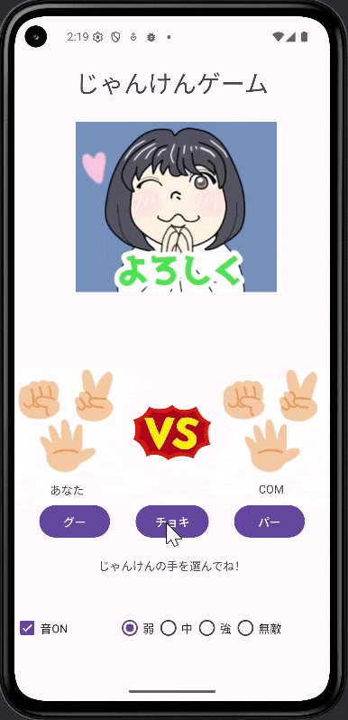
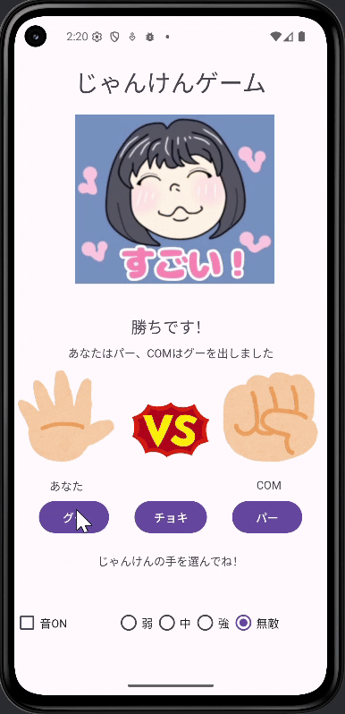

# じゃんけんプログラム(Androidアプリ)

Android Studioの基本学習として作成した、 
Androidアプリ上で動くじゃんけんゲームです。

[概要](#概要)｜
[できる事](#できる事)｜
[使用環境と技術](#使用環境と技術)｜
[実行イメージ](#実行イメージ)｜
[工夫した点](#工夫した点)｜
[苦労や学び](#苦労や学び)｜
[その他](#その他)
 

## 概要 
・Android Studio学習開始約2週間後に作成したプログラムです。 

・処理の流れの理解を目的として作成した、 
　Android上で動作するじゃんけんゲームです。 
　　　> [▲ トップへ戻る](#top)

## できる事 
・ コンピュータとのじゃんけん 
1. じゃんけんの手をタップして、じゃんけん 
1. じゃんけん結果をテキスト・画像で表示 
1. 2連勝以上でトースト表示 
1. 5連勝以上で動画表示 
1. 難易度選択 
1. 効果音ON/OFF 
　> [▲ トップへ戻る](#top)

## 使用環境と技術 
・言語：Java 
・実行環境：Android 
・使用技術： 
　ボタン選択により取得 
　Math.randomによる乱数生成 
　if文 
　トースト表示 
　画像・動画の変更 
　　　> [▲ トップへ戻る](#top)

## 実行イメージ 
【はじめ～勝敗】 
  
  
  

　　　> [▲ トップへ戻る](#top)
 
## 工夫した点 
・じゃんけん処理については、制作効率を考え、 
「コマンドプロンプト上で動くじゃんけんプログラム」をもとにしました。 

・単純な勝敗判定だけでなく、難易度選択、結果を画像で表示、 
　5連勝以上するとトースト表示・動画が流れるようにし、 
　長く楽しめるように工夫しました。 

・難易度について 
　弱・・・COMが弱くなる。一定の割合の場合に、あいこか勝つ 
　強・・・COMが強くなる。一定の割合の場合に、あいこか負ける 
　無敵・・こちらが必ず勝つ。接待モード。 

・音のON/OFFも選択できるようにし、ユーザーに配慮しました。 
　　　> [▲ トップへ戻る](#top)

## 苦労や学び 
・Androidアプリの制作は、見た目や結果・動きがすぐに見れるので 
　楽しく進められました。 

・実機に入れて、実際に周りの方に使用していただき、 
　感想や意見をもらいました。 
　モチベーションUPになり、課題もすぐに反映しました。 
　　　> [▲ トップへ戻る](#top)

## その他 
・人物の画像・動画については、自作のものを使用しております。 
　その他については、「いらすとや」の画像を使用しております。 
　　　> [▲ トップへ戻る](#top)

